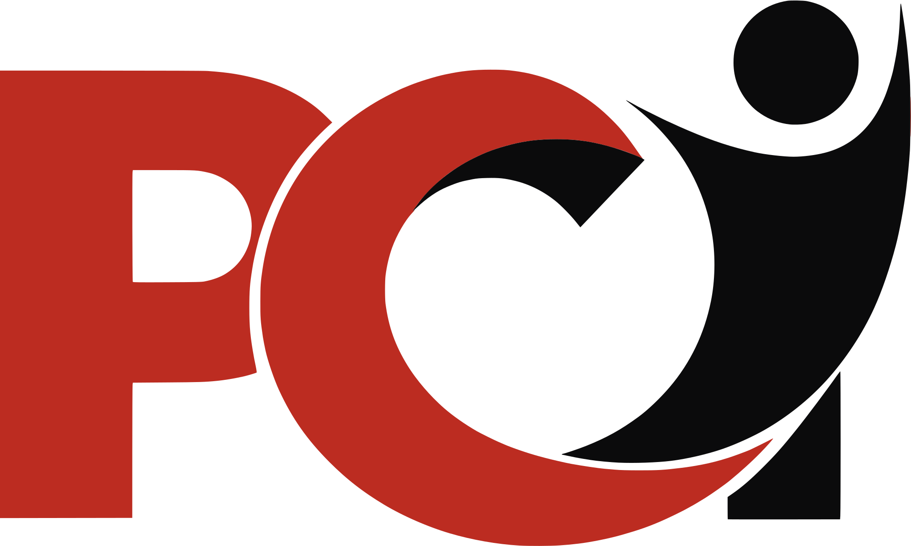
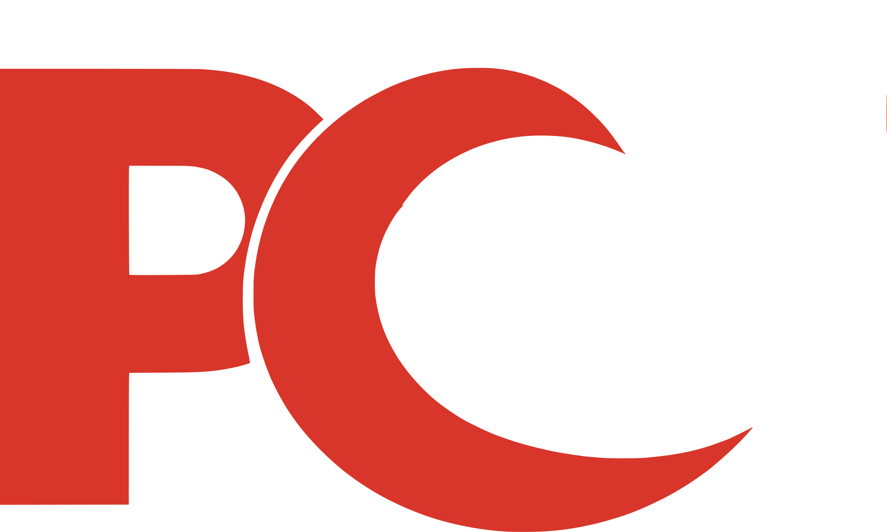

# PCI brand — logo and colour

This is the authoritative reference for the site's identity. Where any older
planning document in this repo describes a different palette (forest/cream/gold,
Rotary blue/gold, navy/teal), **this file supersedes it** — those documents are
kept as a record of earlier decisions.

---

## The logo

The mark is the PCI lockup: a red `PC`, with a black human figure standing in
for the `I`. It is drawn as vector artwork traced from the supplied master, so
it stays crisp at every size.

| File | Use it for |
|---|---|
| `assets/brand/pci-logo.svg` | The lockup on white or light surfaces |
| `assets/brand/pci-logo-onblack.svg` | The lockup on near-black surfaces — the figure becomes white, the red lifts to `#D8362A` |
| `assets/brand/pci-mark.svg` | Square, letterboxed — favicons and anywhere a 1:1 slot is required |
| `assets/brand/pci-mark-onblack.svg` | Square variant for dark slots |
| `assets/brand/pci-icon-180.png` | `apple-touch-icon` (white plate) |
| `assets/brand/pci-icon-512.png` | PWA / share icon (white plate) |
| `assets/brand/pci-icon-maskable-512.png` | Android adaptive icon — artwork inset to the safe zone |
| `favicon.ico` | Legacy 16/32/48 favicon |
| `assets/brand/pci-logo-{256,512,1024}.png` | Transparent raster masters, for places that cannot take SVG |

**Aspect ratio is `2280 / 1369` (≈ 1.665:1).** Never set both `width` and
`height` to the same value — it squashes the mark. Give it a height and let the
width follow.

### Why there are two artworks in the header

Every page opens with a transparent header over a near-black hero, then the
header goes solid white on scroll. The mark's black figure would disappear
against the hero, so the header holds both artworks and cross-fades them:

```html
<span class="logo" aria-hidden="true">
  
  
</span>
```

`.dk` shows by default; `header.solid` swaps to `.lt`. Both images are
decorative (`alt=""`) because the brand link is named by its adjacent text or
its `aria-label` — so the duplication costs nothing to a screen reader.

### Partner marks

`assets/brand/rotary.png` is a **partner credit**, not a site logo. It appears
as the co-brand line in the Faith in Motion footer (`.partner`). Keep it out of
the logo slot.

---

## Colour

Sampled from the logo artwork: red `#BC2C21`, near-black, white. Everything
else is a tone of those three. The full ramp is declared at the top of
`css/pci.css`, `css/fim.css` and `css/pdm.css`.

| Token | Value | Where it earns its place |
|---|---|---|
| `--red-600` | `#BC2C21` | **The brand red.** Primary actions, accents on light surfaces. 5.9:1 on white |
| `--red-500` | `#D8362A` | Hover state on solid red |
| `--red-400` | `#E8574A` | Accents **on near-black** — `--red-600` only reaches ~3.3:1 there, so it is not usable for small text |
| `--red-700` | `#9C231A` | Deep red — offset shadows, accent text needing more weight on white |
| `--red-800` | `#7A1C14` | Button shadow face |
| `--ink-900` | `#0B0B0C` | Primary dark surface, and `theme-color` |
| `--ink-950` | `#08080A` | Deepest surface |
| `--ink-800` | `#16161B` | Secondary dark surface, body text |
| `--grey-500` | `#5F5F6A` | Muted text on white |
| `--grey-200` | `#C4C4CC` | Muted text on near-black |
| `--paper` | `#FFFFFF` | Page ground |
| `--paper-2` | `#F5F3F1` | Alternating section ground; light text on dark |

### The one rule worth remembering

**Red on light → `--red-600`. Red on dark → `--red-400`.** The brand red is too
dark to label against near-black; the lifted red is too light on white. Both
directions fail WCAG AA if you reach for the wrong one. Every page is checked
against 4.5:1 for body text and 3:1 for large text.

### Illustrations

The hero artwork (dawn sky, mountains, blueprint grids) was converted to a
red/black/white duotone by mapping each original colour onto a red or neutral
ramp at **matched OKLab lightness**, so the scenes keep their modelling instead
of flattening. Warm hues went to the red ramp, everything else to the neutral
ramp. If you add artwork, follow the same principle rather than picking hexes
by hand.

The Faith in Motion hero carries a left-weighted scrim (`.hero::after`) because
the sunrise runs bright directly behind the lede — without it that text falls
to ~2.9:1.
